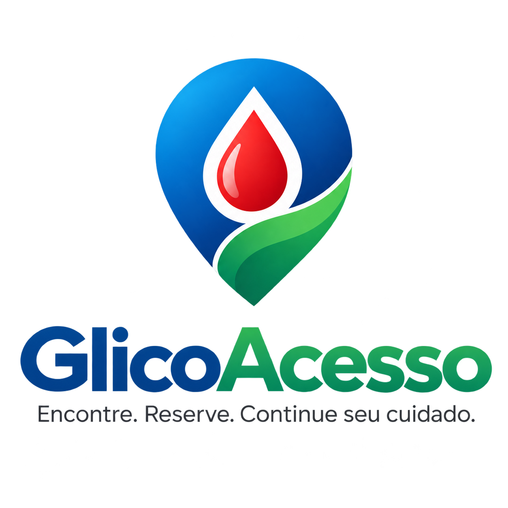
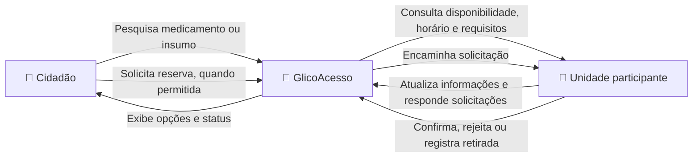

# GlicoAcesso

<p align="center">
    
</p>

> **Encontre. Reserve. Continue seu cuidado.**

O **GlicoAcesso** é uma startup fictícia de impacto social que busca facilitar o acesso de pessoas com diabetes a medicamentos e insumos disponibilizados pela rede pública de saúde.

**Em uma frase:** conectamos cidadãos e unidades públicas de saúde participantes para tornar mais simples descobrir **onde um item está disponível, quando a informação foi atualizada, quais são as regras de retirada e, quando permitido, solicitar uma reserva antes do deslocamento**.

---


## O problema

Imagine uma pessoa que precisa retirar regularmente um medicamento ou insumo para diabetes pela rede pública. Antes de sair de casa, ela precisa responder a perguntas simples:

- **Qual unidade fornece o item de que preciso?**
- **Há disponibilidade informada? Quando ela foi atualizada?**
- **Qual é o horário de retirada?**
- **Quais documentos ou requisitos são necessários?**
- **Existe outra unidade próxima caso aquela não possa atender?**

Quando essas informações estão dispersas ou são difíceis de localizar, o cidadão pode se deslocar até uma unidade e descobrir apenas no local que o item não está disponível ou que a retirada depende de outro procedimento. Isso pode gerar **tempo perdido, gasto com transporte e atraso na retirada**.

O GlicoAcesso não parte da ideia de que todas as pessoas com diabetes deixam de obter seus medicamentos. O problema que buscamos enfrentar é mais específico: **a incerteza sobre onde, quando e como acessar itens disponíveis na rede pública participante**.

### Por que esse problema importa?

- Um estudo nacional com dados da Pesquisa Nacional de Saúde identificou que **69,7% da obtenção de insulina analisada ocorreu pelo serviço público** e encontrou desigualdades de acesso associadas a renda, raça/cor e ausência de plano de saúde.
- O Ministério da Saúde informa que, após a distribuição federal de insulinas e agulhas, as localidades respondem pela distribuição, armazenamento e dispensação, podendo existir particularidades e critérios locais.
- Uma pesquisa nacional em 273 municípios encontrou **disponibilidade média de 52,9% para medicamentos traçadores na atenção primária**, com diferenças regionais. O dado é geral e não específico de diabetes ou insulina.
- A **Lei nº 14.654/2023** exige que os estoques das farmácias públicas do SUS sejam divulgados na internet, atualizados quinzenalmente e apresentados de forma acessível ao cidadão.

Esses dados não significam que uma plataforma digital possa resolver todas as desigualdades de acesso ou o desabastecimento. Eles ajudam a mostrar por que **organizar e tornar utilizáveis as informações de disponibilidade e retirada pode ser relevante**.

---


## A solução

O GlicoAcesso reúne, em um único ambiente, informações das **unidades públicas de saúde participantes** e cria um fluxo entre quem precisa encontrar um item e quem gerencia sua disponibilização.



### Para o cidadão

1. Pesquisa o medicamento ou insumo prescrito.
2. Visualiza unidades participantes que informam disponibilidade do item.
3. Consulta **data de atualização, endereço, horário e requisitos para retirada**.
4. Quando permitido, solicita uma reserva antes de se deslocar.
5. Acompanha a confirmação e a situação da retirada.
6. Caso uma unidade não possa atender, consulta outras opções participantes.

### Para a unidade de saúde

1. Mantém as informações de disponibilidade, horários e requisitos atualizadas.
2. Visualiza solicitações recebidas.
3. Confirma ou rejeita reservas conforme a disponibilidade.
4. Registra a retirada dos itens.
5. Acompanha demanda e indisponibilidades.

### De onde vêm os dados?

Nesta fase acadêmica, os dados são **simulados** e poderão ser atualizados pelas próprias unidades no sistema.

Em uma implantação real, a plataforma poderia combinar diferentes formas de atualização conforme a infraestrutura da rede de saúde: atualização manual por profissionais autorizados, importação periódica de dados e integração com sistemas de estoque já existentes quando houver mecanismos de interoperabilidade disponíveis.

Em todos os casos, o GlicoAcesso deve mostrar de forma clara **quando a informação foi atualizada**, evitando apresentar um dado antigo como se fosse uma confirmação em tempo real.

> O GlicoAcesso não precisa começar com todas as unidades do país. A proposta pode ser adotada inicialmente por uma **rede municipal ou conjunto de unidades participantes**, expandindo à medida que novas unidades aderirem.

---


## Impacto social esperado

O objetivo do GlicoAcesso não é criar estoque onde ele não existe, mas **reduzir a incerteza e o custo de encontrar e retirar um item disponível na rede participante**.

Os beneficiários incluem pessoas com diabetes que dependem do SUS, familiares e cuidadores, profissionais das unidades e gestores municipais de saúde. O impacto pode ser especialmente relevante para pessoas com menor renda, mobilidade reduzida ou que vivem longe das unidades de dispensação, para quem um deslocamento sem sucesso pode representar um custo maior.

### Como vamos saber se a ideia funciona?

| Objetivo | Indicador proposto |
| --- | --- |
| Tornar a busca mais rápida | **Tempo para localizar uma unidade apta** |
| Reduzir viagens sem resultado | **Taxa de deslocamentos sem sucesso** |
| Dar previsibilidade à solicitação | **Taxa de reservas confirmadas** |
| Acompanhar o acesso até a retirada | **Tempo entre solicitação e retirada** |
| Melhorar a experiência | **Satisfação do usuário** |
| Apoiar a organização das unidades | **Solicitações atendidas, rejeitadas ou expiradas** |

Esses indicadores medem resultados diretamente relacionados ao que a plataforma se propõe a melhorar. O projeto **não atribui diretamente ao GlicoAcesso a redução de amputações, internações ou mortes**, pois esses resultados dependem de diversos fatores clínicos, sociais e estruturais.

---


## O que o GlicoAcesso é - e o que não é

| O GlicoAcesso **faz** | O GlicoAcesso **não faz** |
| --- | --- |
| Facilita a localização de unidades participantes | Não realiza diagnóstico |
| Organiza informações de disponibilidade e retirada | Não recomenda doses ou altera prescrições |
| Mostra quando a informação foi atualizada | Não cria medicamentos ou resolve desabastecimento |
| Permite solicitar reserva quando a unidade oferecer esse fluxo | Não garante disponibilidade nacional |
| Apoia unidades na gestão das solicitações e retiradas | Não substitui profissionais ou sistemas públicos de saúde |

A proposta é atuar como uma **ponte entre a informação existente na rede participante e o cidadão que precisa utilizá-la**.

> **GlicoAcesso: encontre, reserve e continue seu cuidado.**

---

## Estado atual do projeto

O projeto está na **Parte 1 - Concepção e Pitch** da disciplina de Sistemas Distribuídos. Nesta etapa, o foco é validar o problema, a proposta de valor e o impacto social esperado.

Ainda não há sistema executável. A implementação e a arquitetura distribuída serão desenvolvidas nas próximas etapas do trabalho.

## Adequação à disciplina de Sistemas Distribuídos

O GlicoAcesso foi concebido de forma que sua evolução para as próximas etapas da disciplina de **Sistemas Distribuídos** possa explorar problemas reais de comunicação, consistência e coordenação entre diferentes serviços.

A arquitetura proposta considera quatro microsserviços principais de domínio:

* **Unidades** — responsável pelos dados das unidades participantes, endereços, horários e informações de atendimento.
* **Estoque** — responsável pela disponibilidade e movimentação dos medicamentos e insumos.
* **Reservas** — responsável pelas solicitações e estados das reservas realizadas pelos cidadãos.
* **Retiradas** — responsável pelo registro e acompanhamento da retirada dos itens reservados.

Cada microsserviço poderá possuir **seu próprio banco de dados**, mantendo o isolamento dos domínios e permitindo que os serviços evoluam e sejam escalados de forma independente.

### Transações distribuídas

Um dos principais desafios distribuídos do sistema está no processo de **reserva**. Uma solicitação pode envolver diferentes serviços: a reserva precisa ser registrada, o estoque precisa ser verificado e, posteriormente, a retirada precisa ser registrada.

Como não existe uma única transação ACID envolvendo todos os bancos de dados, esse fluxo poderá ser implementado utilizando o padrão **SAGA**, com uma abordagem **orquestrada**.

Nesse modelo, um componente orquestrador coordena as etapas da reserva e, caso alguma etapa falhe, executa **ações de compensação** para desfazer os efeitos das etapas que já foram concluídas. Dessa forma, o sistema consegue lidar com falhas parciais sem depender de uma transação distribuída tradicional.

### CQRS e Outbox

O microsserviço de **Estoque** também apresenta características que permitem explorar padrões arquiteturais distribuídos.

Como o sistema deverá realizar muitas consultas de disponibilidade, ao mesmo tempo em que recebe operações de atualização de estoque, o serviço é um candidato ao uso de **CQRS (Command Query Responsibility Segregation)**, separando as operações de leitura das operações de escrita.

Além disso, o padrão **Outbox** poderá ser utilizado para garantir maior confiabilidade na publicação de eventos. Alterações importantes no estoque podem ser registradas em uma tabela Outbox dentro da mesma transação que atualiza o banco de dados. Um processo posterior pode publicar esses eventos para os demais serviços, reduzindo o risco de uma alteração ser persistida sem que o evento correspondente seja enviado.

### BFFs para os diferentes clientes

O sistema possui dois tipos principais de usuários:

* **Cidadão**, que pesquisa itens, consulta unidades e solicita reservas.
* **Unidade de saúde**, que atualiza estoques, gerencia reservas e registra retiradas.

Por possuírem necessidades diferentes, a arquitetura poderá utilizar **BFFs (Backend for Frontend) distintos**:

```text
                    ┌─────────────────────┐
                    │      Cidadão        │
                    └──────────┬──────────┘
                               │
                        ┌──────▼──────┐
                        │ BFF Cidadão │
                        └──────┬──────┘
                               │
              ┌────────────────┼────────────────┐
              │                │                │
        ┌─────▼─────┐    ┌─────▼─────┐   ┌─────▼─────┐
        │ Unidades  │    │  Estoque   │   │  Reservas │
        └───────────┘    └───────────┘   └─────┬─────┘
                                               │
                                         ┌─────▼─────┐
                                         │ Retiradas │
                                         └───────────┘

                    ┌─────────────────────┐
                    │ Unidade de Saúde    │
                    └──────────┬──────────┘
                               │
                        ┌──────▼───────┐
                        │ BFF Unidade  │
                        └──────────────┘
```

Os BFFs permitem adaptar as interfaces e os dados disponibilizados para cada tipo de cliente sem transferir essa responsabilidade diretamente para os microsserviços de domínio.

### RAG e ferramentas na etapa final

Em uma etapa posterior, o GlicoAcesso também poderá incorporar uma solução de **RAG (Retrieval-Augmented Generation)** para auxiliar o cidadão na compreensão de regras e procedimentos de dispensação.

O RAG poderá utilizar documentos institucionais, regras de dispensação e informações previamente cadastradas para responder perguntas como:

* Quais documentos são necessários para retirar determinado item?
* Quais são os requisitos para a dispensação?
* Como funciona o processo de retirada?
* Quais são os procedimentos adotados pela unidade?

Para informações que precisam refletir o **estado atual do sistema**, como quantidade disponível ou situação de uma reserva, o assistente não dependerá apenas dos documentos recuperados. Uma **tool** poderá consultar diretamente os microsserviços responsáveis pelos dados reais.

Dessa forma, a arquitetura separa informações documentais, recuperadas pelo RAG, de informações operacionais e dinâmicas, consultadas diretamente nos serviços do sistema.

### Relação com os objetivos da disciplina

A evolução proposta permite que o GlicoAcesso explore, nas próximas etapas, diferentes conceitos de Sistemas Distribuídos:

| Conceito              | Aplicação no GlicoAcesso                                          |
| --------------------- | ----------------------------------------------------------------- |
| **Microsserviços**    | Separação dos domínios em Unidades, Estoque, Reservas e Retiradas |
| **Banco por serviço** | Cada microsserviço mantém seus próprios dados                     |
| **SAGA**              | Coordenação distribuída do processo de reserva                    |
| **Compensação**       | Tratamento de falhas durante uma reserva                          |
| **CQRS**              | Separação entre consultas e alterações no Estoque                 |
| **Outbox**            | Publicação confiável de eventos de alteração                      |
| **BFF**               | Interfaces específicas para cidadão e unidade                     |
| **RAG**               | Consulta de documentos e regras de dispensação                    |
| **Tools**             | Consulta de dados operacionais reais, como estoque e reservas     |

Assim, a proposta inicial do GlicoAcesso não se limita a uma aplicação CRUD tradicional. O domínio escolhido apresenta situações que justificam a aplicação progressiva de **comunicação entre serviços, consistência eventual, eventos, transações distribuídas, tolerância a falhas e diferentes formas de acesso aos dados**, permitindo que o projeto seja desenvolvido de acordo com os objetivos das próximas etapas da disciplina.


## Integrantes

- Marcos Vinícius Pereira
- Arthur Soares Marques
- Lana da Silva Miranda
- Guilherme Lirio Miranda

## Documentação

O detalhamento da concepção, das evidências, do impacto e do roteiro do pitch está em:

- [`docs/parte-1-concepcao-e-pitch.md`](./docs/parte-1-concepcao-e-pitch.md)

## Como executar

Como o projeto ainda está na etapa de concepção, não há serviços para executar. Para consultar o repositório localmente:

```bash
git clone https://github.com/ArthurDp78/GlicoAcesso.git
cd GlicoAcesso
```

As instruções para subir o sistema completo serão adicionadas conforme a implementação avançar nas próximas etapas.

## Referências

1. [International Diabetes Federation - Dados sobre diabetes no Brasil](https://diabetesatlas.org/es/data-by-location/country/brazil/).
2. [Leal et al. - Acesso a medicamentos para hipertensão e diabetes](https://doi.org/10.1590/0102-311XPT241022).
3. [Nascimento et al. - Disponibilidade de medicamentos essenciais](https://doi.org/10.11606/S1518-8787.2017051007062).
4. [Ministério da Saúde - Insulinas humanas e agulhas para caneta](https://www.gov.br/saude/pt-br/composicao/sectics/daf/cbaf/insulinas-humanas).
5. [Brasil - Lei nº 14.654/2023](https://www.planalto.gov.br/ccivil_03/_ato2023-2026/2023/lei/l14654.htm).
6. [PNAUM - Acesso e adesão a medicamentos entre pessoas com diabetes no Brasil](https://doi.org/10.1590/1980-549720180003).
