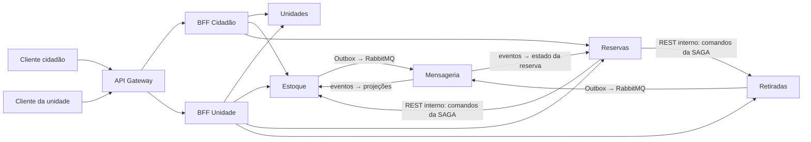

# GlicoAcesso — decisões arquiteturais compartilhadas

**Etapa:** 2 — Arquitetura  
**Versão:** 1.0  
**Situação:** contrato-base para os documentos da Etapa 2  
**Última revisão:** 9 de outubro de 2026

> Este documento estabelece a linguagem e as decisões que devem ser usadas por todas as pessoas do grupo. Os documentos de APIs, persistência, SAGA, Gateway e BFFs detalham estas decisões; não podem redefinir o mesmo conceito de outra forma. Se uma decisão precisar mudar, a alteração deve ser registrada aqui e propagada aos documentos afetados antes de ser considerada válida.

## 1. Para que serve este documento

Uma pessoa que não participou das conversas do grupo deve conseguir entender, somente por esta documentação:

1. qual problema o GlicoAcesso atende e qual é o limite do sistema;
2. quais são os quatro microsserviços e quem é dono de cada informação;
3. como uma solicitação de item passa de pedido a confirmação e retirada;
4. como a SAGA confirma a reserva e desfaz etapas concluídas quando há falha;
5. como os serviços se comunicam sem compartilhar bancos;
6. quais identificadores, estados e eventos devem ser usados nos demais documentos;
7. quais decisões técnicas já estão fixadas e quais detalhes pertencem a cada documento especializado.

Este é um contrato arquitetural da Etapa 2. O enunciado avalia o projeto documentado nesta etapa; a implementação executável será demonstrada nas etapas posteriores. Ainda assim, as decisões foram escolhidas para poderem ser implementadas depois sem trocar a semântica do sistema.

## 2. Base e força das decisões

As decisões deste arquivo atendem aos requisitos da Parte 2 do enunciado: decomposição e fronteiras (4.1), API REST e HATEOAS (4.2), Gateway (4.3), BFFs (4.4), bancos por serviço, consistência eventual e Outbox (4.5), SAGA (4.6) e CQRS (4.7).

Para interpretar o texto:

- **DEVE** indica regra obrigatória para os documentos e para a futura implementação.
- **NÃO DEVE** indica comportamento proibido pela arquitetura.
- **PODE** indica escolha permitida desde que não contradiga uma regra obrigatória.
- Uma sugestão feita em outro documento não substitui uma decisão deste arquivo.
- A palavra “reserva” sempre se refere à solicitação de uma quantidade de um item (medicamento ou insumo) para retirada em uma unidade; não significa entrega domiciliar nem recomendação clínica.

## 3. Problema, objetivo e limites do sistema

O GlicoAcesso organiza a consulta de disponibilidade e a solicitação de medicamentos e insumos para diabetes em unidades públicas de saúde. O cidadão pode localizar unidades, verificar a disponibilidade informada, solicitar uma reserva e acompanhar o resultado. A equipe de uma unidade pode administrar seu estoque, avaliar solicitações, preparar autorizações e registrar a retirada presencial.

O sistema coordena informações e etapas administrativas. Ele **não** diagnostica, prescreve, substitui a avaliação de profissionais de saúde nem garante que uma consulta de disponibilidade equivale a uma reserva confirmada. A consulta pode estar alguns segundos atrasada; a confirmação depende de uma alocação validada pelo serviço de Estoque.

### 3.1 Atores

| Ator | O que pode fazer no escopo da Etapa 2 |
|---|---|
| Cidadão | Consultar unidades e disponibilidade; criar, acompanhar e cancelar a própria solicitação antes da retirada física. |
| Profissional da unidade | Consultar solicitações destinadas à sua unidade; rejeitar ou aceitar uma solicitação; administrar o estoque da unidade; registrar uma retirada autorizada. |
| Serviços internos | Executar a confirmação distribuída, publicar eventos e atualizar projeções de leitura. |

As credenciais e a identidade do ator são verificadas na borda/API. Nos dados de domínio, os serviços usam um identificador estável do ator, sem copiar perfil, senha ou dados de autenticação para os bancos dos microsserviços.

### 3.2 Unidade de solicitação

Uma reserva contém **exatamente um item, uma unidade de retirada e uma quantidade positiva**. O item pode ser medicamento ou insumo. Se o cidadão precisar de dois itens, cria duas reservas independentes. Essa regra evita confirmação parcial de itens e torna o resultado da SAGA inequívoco.

Cada solicitação tem um cidadão solicitante e uma unidade de retirada. O vínculo entre cidadão, unidade, item e quantidade é referencial: cada serviço mantém apenas os identificadores externos necessários, não cópias das tabelas de outro serviço.

## 4. Vocabulário canônico

| Termo | Significado único neste projeto |
|---|---|
| Unidade | Estabelecimento público em que o estoque é mantido e a retirada ocorre. |
| Item | Medicamento ou insumo do catálogo administrado pelo serviço de Estoque. |
| Estoque físico | Quantidade registrada fisicamente como pertencente à unidade. |
| Quantidade alocada | Parte do estoque físico reservada para uma reserva confirmada, ainda não retirada. |
| Disponibilidade | Quantidade calculada para consulta: estoque físico menos alocações ativas, conforme a projeção de leitura. Pode estar defasada. |
| Reserva | Solicitação de um item e quantidade em uma unidade, identificada por `reservaId`. Cada reserva contém exatamente um item. |
| Alocação | Retenção de quantidade no Estoque, vinculada a uma única reserva. Não representa entrega física. |
| Autorização de retirada | Registro criado pelo serviço de Retiradas após a alocação; permite que a unidade reconheça a reserva no balcão. Não significa que o item foi entregue. |
| Retirada | Entrega presencial efetivamente registrada pela unidade. |
| SAGA | Processo distribuído de confirmação de uma reserva, coordenado pelo serviço de Reservas e compensado quando uma etapa posterior falha. |
| Compensação | Operação de negócio que desfaz o efeito de uma etapa concluída. Não é rollback de uma transação única entre bancos. |
| Evento | Fato passado e imutável publicado por um serviço para que outros serviços atualizem suas próprias projeções. |

“Confirmada” e “retirada” não são sinônimos: uma reserva confirmada tem estoque alocado e autorização preparada; só passa a retirada quando a unidade registra a entrega física.

## 5. Serviços e propriedade dos dados

Existem quatro microsserviços de domínio. Cada um tem seu próprio banco PostgreSQL, em instância separada. Um serviço é o único responsável por gravar seus dados; os demais consultam sua API ou recebem eventos. **É proibido** que um serviço leia ou escreva diretamente no banco de outro serviço.

| Serviço | Responsabilidade e dados que possui | Não possui |
|---|---|---|
| **Unidades** | Cadastro e consulta de unidades, endereço, contatos institucionais, horários e informações de atendimento. Também configura o prazo de análise `prazoAnalise` para solicitações da unidade. | Estoque de itens, configuração de `permiteReserva`, reservas, autorização ou histórico de retirada. |
| **Estoque** | Catálogo de medicamentos e insumos; estoque físico por unidade e item; movimentações; configuração de `permiteReserva` por unidade/item; alocações associadas a `reservaId`; modelo de leitura de disponibilidade; Outbox de eventos de estoque. | Dados pessoais do cidadão, decisão de aceitar uma solicitação, autorização ou prova de retirada. |
| **Reservas** | Solicitações e seu estado de negócio; decisão da unidade; coordenação e estado durável da SAGA; resultado da confirmação; referências a cidadão, unidade e item. | Saldo canônico de estoque ou registro da entrega física. |
| **Retiradas** | Autorizações preparadas/canceladas; registro de quem e quando realizou a entrega; identificador da reserva associada. | Saldo do estoque ou decisão de disponibilidade. |

### 5.1 Regras de fronteira

1. Cada serviço mantém a verdade do seu domínio. Por exemplo, Reservas pode exibir `itemId`, mas o nome, o tipo e a descrição canônicos do item pertencem a Estoque.
2. Uma chave estrangeira entre bancos não é usada. Relações entre serviços são referências por UUID, validadas por contrato de API ou evento.
3. Não se faz transação ACID distribuída entre os quatro bancos. Cada serviço confirma suas próprias transações locais.
4. BFFs podem combinar respostas de serviços para cada cliente, mas não se tornam donos dos dados nem armazenam cópias como fonte de verdade.
5. A aplicação da Etapa 2 não cria um quinto serviço de identidade. Autenticação pode ser fornecida por um provedor externo; identidade e autorização de chamadas são tratadas na borda e propagadas aos serviços conforme necessário.

## 6. Arquitetura de comunicação

### 6.1 Componentes e caminhos



O diagrama é lógico: cada microsserviço tem sua instância PostgreSQL independente, não desenhada para manter o desenho legível. Os diagramas dos documentos especializados podem mostrar bancos, filas e fluxos de erro com mais detalhe, sem alterar estas fronteiras.

### 6.2 Regras de chamada

- O Gateway expõe apenas os dois BFFs. Clientes não chamam microsserviços de domínio diretamente.
- Os BFFs fazem consultas e comandos próprios de cada tipo de cliente e podem agregar respostas. Eles não implementam a SAGA.
- A confirmação da SAGA é coordenada por **Reservas**, que envia comandos internos REST a Estoque e Retiradas.
- Mensagens RabbitMQ propagam fatos para projeções e atualização de estados derivados. Elas não substituem o comando de confirmação nem transferem a coordenação da SAGA para os participantes.
- As APIs públicas são versionadas sob `/api/cidadao/v1` e `/api/unidade/v1`. As chamadas entre serviços usam rotas internas versionadas sob `/internal/v1`; essas rotas não são publicadas pelo Gateway.
- As APIs usam JSON UTF-8. Os nomes dos campos JSON são `camelCase`; identificadores são UUID em formato textual; instantes são ISO 8601 em UTC.

### 6.3 Decisões tecnológicas compartilhadas

| Decisão | Padrão adotado | Razão e consequência |
|---|---|---|
| Bancos | PostgreSQL, uma instância independente por serviço. | Os dados são relacionais e exigem transações locais; instâncias separadas evidenciam Database per Service e impedem acoplamento acidental. A escolha não obriga que os quatro serviços tenham esquemas idênticos. |
| Mensageria | RabbitMQ, com filas duráveis e entrega pelo menos uma vez. | É suficiente para os eventos de integração e projeções do projeto e é simples de executar no ambiente local. Consumidores devem tolerar duplicatas. |
| SAGA | Orquestrada pelo serviço de Reservas. | Há uma sequência curta e conhecida; um único coordenador torna a ordem, o estado de recuperação e a compensação demonstráveis. |
| CQRS | Serviço de Estoque. | Escritas precisam validar a quantidade canônica; consultas de disponibilidade podem ser otimizadas e aceitam pequena defasagem. |
| Outbox | Obrigatória para publicar eventos derivados de alterações persistidas. O fluxo de estoque é a implementação/projeto mínimo exigido. | A gravação do dado e do evento ocorre na mesma transação local, evitando dual write entre banco e broker. |

A tecnologia específica do Gateway, a linguagem dos serviços e bibliotecas/frameworks podem ser especificados nos documentos de implementação de cada frente, desde que preservem estes contratos. Se o grupo escolher um broker ou banco diferente, a mudança precisa ser justificada e revisada nos documentos de persistência, eventos, Compose e apresentação; não pode ser alterada silenciosamente em apenas um arquivo.

## 7. Identificadores e formatos canônicos

| Campo | Tipo/forma | Criado e controlado por | Uso |
|---|---|---|---|
| `unidadeId` | UUID | Unidades | Referência estável à unidade em Estoque, Reservas e Retiradas. |
| `itemId` | UUID | Estoque | Referência estável a um medicamento ou insumo em Reservas e Retiradas. |
| `reservaId` | UUID | Reservas | Chave de correlação da solicitação, da alocação e da autorização/retirada. |
| `cidadaoId` | UUID/string estável do provedor de identidade | Provedor de identidade | Referência ao solicitante; Reservas não copia credenciais ou perfil completo. |
| `alocacaoId` | UUID | Estoque | Identifica a alocação criada para uma reserva; no máximo uma alocação ativa por `reservaId`. |
| `autorizacaoId` | UUID | Retiradas | Identifica a autorização de retirada vinculada a uma reserva. |
| `retiradaId` | UUID | Retiradas | Identifica a entrega presencial efetivamente registrada. |
| `sagaId` | UUID | Reservas | Identifica uma execução da SAGA. Confirmação e cancelamento são execuções distintas, vinculadas ao mesmo `reservaId`; retries da mesma execução reutilizam o mesmo `sagaId`. Só pode haver uma execução ativa por reserva. |
| `eventId` | UUID | Serviço produtor | Identificador global de uma mensagem; consumidores registram-no para deduplicação. |
| `correlationId` | UUID | BFF/Gateway na entrada, se não recebido | Agrupa logs e chamadas da mesma requisição ponta a ponta. |
| `idempotencyKey` | String opaca fornecida pelo chamador ou calculada por operação interna | Chamador da operação | Evita criação/execução duplicada após retry. O mesmo valor com o mesmo corpo retorna o resultado original; o mesmo valor com corpo diferente é conflito. |

Identificadores de outras fronteiras são tratados como referências opacas. Um consumidor não deduz informações de negócio a partir dos caracteres de um UUID.

## 8. Fluxo de negócio e estados da reserva

### 8.1 Caminho normal

1. O cidadão consulta a disponibilidade e escolhe uma unidade e um item (medicamento ou insumo). A consulta é informativa, não uma garantia de estoque.
2. A solicitação só pode ser criada se a unidade permitir reservas para aquele item (`permiteReserva = true`). O BFF Cidadão envia a Reservas `unidadeId`, `itemId`, `quantidade` e a identidade autenticada do cidadão.
3. Reservas valida com Estoque que `permiteReserva` está habilitado para aquele `unidadeId` e `itemId`, obtém de Unidades o `prazoAnalise` configurado, registra `SOLICITADA` e `decisaoAte = criadaEm + prazoAnalise` e devolve seu `reservaId`. Uma unidade só pode habilitar reservas se tiver configurado esse prazo.
4. Um profissional da unidade analisa a solicitação. Pode rejeitá-la ou aceitá-la. A decisão é autorizada para a unidade indicada na reserva.
5. Ao aceitar, Reservas grava `EM_CONFIRMACAO`, cria o registro durável da SAGA e inicia o trabalho de confirmação.
6. Estoque tenta alocar atomicamente a quantidade solicitada para `reservaId`. A verificação é feita no modelo de escrita atual, não na projeção de disponibilidade.
7. Se a alocação funcionar, Retiradas cria uma autorização de retirada ligada a `reservaId` e `autorizacaoId`.
8. Se ambas as etapas forem bem-sucedidas, Reservas grava `CONFIRMADA` e a SAGA termina com sucesso.
9. No balcão, o profissional valida a autorização e registra a entrega efetiva no serviço de Retiradas. A reserva passa a `RETIRADA` após o evento de retirada concluída ser processado por Reservas.

O aceite pela unidade é uma decisão anterior à SAGA; a confirmação só é comunicada ao cidadão após a alocação e a preparação da autorização. Assim, “aceita pela unidade” não equivale a “confirmada”.

### 8.2 Estados e transições permitidas

O campo `status` é o estado de negócio visível da reserva. Somente estas transições são válidas:

| Estado atual | Ação e condição | Estado seguinte |
|---|---|---|
| — | Pedido válido registrado | `SOLICITADA` |
| `SOLICITADA` | Profissional da unidade rejeita | `REJEITADA` |
| `SOLICITADA` | Cidadão cancela, profissional autorizado cancela com justificativa, ou o prazo de decisão vence | `CANCELADA` ou `EXPIRADA` |
| `SOLICITADA` | Profissional autorizado aceita; SAGA iniciada | `EM_CONFIRMACAO` |
| `EM_CONFIRMACAO` | Estoque alocado, autorização criada e finalização local gravada | `CONFIRMADA` |
| `EM_CONFIRMACAO` | Uma etapa falha e todas as compensações necessárias terminam | `FALHA_CONFIRMACAO` |
| `EM_CONFIRMACAO` | Cidadão cancela ou profissional autorizado cancela com justificativa; efeitos parciais são compensados | `CANCELAMENTO_EM_ANDAMENTO`, depois `CANCELADA` |
| `CONFIRMADA` | Cidadão cancela ou profissional autorizado cancela com justificativa; autorização cancelada e alocação liberada | `CANCELAMENTO_EM_ANDAMENTO`, depois `CANCELADA` |
| `CONFIRMADA` | Retirada física registrada e evento processado | `RETIRADA` |

Estados terminais: `REJEITADA`, `CANCELADA`, `EXPIRADA`, `FALHA_CONFIRMACAO` e `RETIRADA`. No escopo desta etapa, não há reabertura de uma reserva terminal; deve ser criada outra solicitação.

Regras adicionais:

- Não existe transição direta de `SOLICITADA` para `CONFIRMADA`: a unidade precisa decidir e a SAGA precisa concluir.
- O cidadão pode cancelar a própria reserva enquanto ela estiver ativa e antes da retirada física. Um profissional autenticado e vinculado à unidade da reserva também pode cancelar; para esse ator, `justificativa` é obrigatória e fica registrada na auditoria. Uma reserva rejeitada, expirada, cancelada, retirada ou com falha de confirmação já é terminal e não aceita cancelamento adicional.
- A expiração automática ocorre somente enquanto a reserva está `SOLICITADA`: quando `agora >= decisaoAte` e nenhuma decisão venceu a corrida, Reservas muda o estado para `EXPIRADA`. O prazo é configurado por unidade em `prazoAnalise` e copiado para `decisaoAte` ao criar a solicitação. Como a SAGA ainda não começou, não há estoque a liberar. Reserva `EM_CONFIRMACAO` não expira por relógio: é finalizada ou cancelada pela SAGA.
- `CONFIRMADA` pode ser cancelada, mas o cancelamento coordena a revogação da autorização e a liberação da alocação antes de mudar para `CANCELADA`.
- `CANCELAMENTO_EM_ANDAMENTO` informa que o pedido foi aceito, mas efeitos distribuídos ainda estão sendo revertidos. Só passa a `CANCELADA` depois da confirmação de todas as operações aplicáveis.
- Retirada e cancelamento são concorrentes: Retiradas deve garantir que apenas um deles possa vencer. Se a entrega física for registrada primeiro, o cancelamento é recusado; se o cancelamento concluir primeiro, a autorização não pode mais ser usada.
- `RETIRADA`, `REJEITADA`, `CANCELADA`, `EXPIRADA` e `FALHA_CONFIRMACAO` não voltam a estados anteriores.
- Os estados da execução da SAGA são distintos do estado de negócio e são descritos na seção 9. Uma SAGA com retry ou compensação pendente não deve ser apresentada como falha final.

## 9. SAGA de confirmação

### 9.1 Modelo escolhido

A SAGA é **orquestrada**. O serviço de Reservas mantém seu estado durável, decide qual etapa executar, interpreta respostas dos participantes e inicia compensações quando necessário. Estoque e Retiradas executam comandos idempotentes e não chamam um ao outro.

A transação atravessa três serviços: Reservas, Estoque e Retiradas. A decisão operacional da unidade inicia o processo, mas a unidade não coordena a SAGA.

Escolhemos orquestração porque a sequência e a regra de compensação são conhecidas, e a disciplina exige demonstrar caminho feliz e falha com compensação. Coreografia distribuiria a decisão entre consumidores de eventos e tornaria mais difícil visualizar o estado total e provar qual passo deve ser compensado.

### 9.2 Etapas, efeitos e compensações

| Ordem | Serviço | Comando/resultado | Efeito local | Compensação |
|---:|---|---|---|---|
| 0 | Reservas | `AceitarReserva` | Registra decisão da unidade, muda para `EM_CONFIRMACAO` e persiste a SAGA como `EM_EXECUCAO`. | Se a transação local não confirmar, não se envia comando aos participantes. |
| 1 | Estoque | `AlocarEstoque(reservaId, unidadeId, itemId, quantidade)` | Valida o saldo canônico e cria uma alocação ativa. Uma reserva não pode ter duas alocações ativas. | `LiberarAlocacao(reservaId)`, que libera apenas a alocação da reserva correspondente. |
| 2 | Retiradas | `PrepararAutorizacao(reservaId, unidadeId, itemId, quantidade)` | Cria autorização apta a ser usada no balcão; não registra entrega. | `CancelarAutorizacao(reservaId)`, idempotente e sem apagar histórico. |
| 3 | Reservas | `FinalizarConfirmacao(reservaId)` | Muda a reserva para `CONFIRMADA` e a SAGA para `CONCLUIDA`. | Se a persistência local falhar temporariamente, repetir a finalização idempotente. Se a falha for definitiva, compensar Retiradas e Estoque. |

As operações inversas são executadas na ordem inversa dos efeitos concluídos: cancelar autorização e depois liberar alocação. A SAGA não deve liberar estoque antes de cancelar ou confirmar o estado da autorização.

### 9.3 Fluxo distribuído de cancelamento

O cancelamento após o início da confirmação é coordenado por Reservas e usa o mesmo `reservaId`, com comandos idempotentes:

1. Reservas valida condicionalmente que a reserva ainda não está `RETIRADA` e registra `CANCELAMENTO_EM_ANDAMENTO`, o ator e o instante do pedido. Se o ator for profissional da unidade, exige e registra uma justificativa não vazia.
2. Se existir autorização, Reservas envia a Retiradas `CancelarAutorizacao(reservaId)`.
3. Se existir alocação ativa, Reservas envia ao Estoque `LiberarAlocacao(reservaId)`.
4. Depois de confirmar todas as operações aplicáveis, Reservas registra `CANCELADA`.
5. Se um participante estiver indisponível ou o resultado for incerto, manter o cancelamento em andamento e repetir/consultar usando a mesma chave idempotente. Não informar que a reserva foi cancelada antes da reconciliação.
6. Retiradas deve tornar mutuamente exclusivos o cancelamento da autorização e o registro da retirada física. Se `RegistrarRetirada` tiver sido confirmado primeiro, o cancelamento falha por conflito de estado; se o cancelamento concluir primeiro, a autorização não pode ser usada para retirar o item.

O cancelamento de uma reserva ainda `SOLICITADA` é local a Reservas e não chama Estoque ou Retiradas. Uma reserva `EM_CONFIRMACAO` entra em `CANCELAMENTO_EM_ANDAMENTO`; Reservas interrompe passos futuros e compensa, em ordem inversa, apenas os efeitos que já tenham sido confirmados. A expiração de `SOLICITADA` também não exige compensação porque ainda não existe alocação.

### 9.4 Estados da execução da SAGA

O registro interno da SAGA usa os estados:

- `EM_EXECUCAO`: um passo ainda será tentado ou está em processamento;
- `COMPENSANDO`: houve falha de negócio/terminal após um ou mais efeitos e as compensações estão sendo aplicadas;
- `COMPENSACAO_PENDENTE`: uma compensação não foi confirmada; o sistema continuará tentando e alertará a operação;
- `CANCELANDO`: um pedido explícito de cancelamento está revertendo efeitos distribuídos;
- `CANCELAMENTO_PENDENTE`: não foi possível confirmar uma operação de cancelamento; o sistema continuará tentando;
- `CONCLUIDA`: reserva confirmada;
- `COMPENSADA`: efeitos distribuídos revertidos após falha de confirmação; reserva marcada `FALHA_CONFIRMACAO`;
- `CANCELADA`: efeitos distribuídos revertidos por solicitação de cancelamento; reserva marcada `CANCELADA`.

`COMPENSACAO_PENDENTE` e `CANCELAMENTO_PENDENTE` não são resultados finais para o cidadão. A reserva permanece em `EM_CONFIRMACAO` ou `CANCELAMENTO_EM_ANDAMENTO` até o estado distribuído ser reconciliado. A equipe deve conseguir localizar a execução por `sagaId`/`reservaId` e verificar etapa, tentativas e erro técnico, sem expor detalhes internos ao cidadão.

### 9.5 Falhas, timeouts e recuperação

1. **Rejeição de negócio do Estoque** (quantidade insuficiente, item/unidade inexistente ou incompatibilidade): não há alocação. Reservas marca falha final e a SAGA `COMPENSADA`; não chama Retiradas.
2. **Falha de Retiradas depois da alocação**: Reservas solicita `LiberarAlocacao`. Depois da confirmação da liberação, marca `FALHA_CONFIRMACAO` e `COMPENSADA`.
3. **Falha temporária ou timeout**: timeout não prova que a operação remota falhou. Reservas mantém a etapa como resultado desconhecido, repete a mesma operação idempotente ou consulta o resultado por `reservaId` antes de decidir compensar.
4. **Serviço participante indisponível antes de produzir efeito**: manter a SAGA em execução e tentar novamente com backoff limitado; não marcar falha final apenas por timeout.
5. **Compensação indisponível**: marcar `COMPENSACAO_PENDENTE`, persistir a etapa, tentar novamente com backoff e gerar alerta operacional. Não fingir que a reserva está liberada.
6. **Queda de Reservas**: ao reiniciar, recuperar Sagas não terminais do seu próprio banco e continuar do último passo persistido. Não depender apenas de memória ou de uma requisição HTTP ainda aberta.
7. **Resultado incerto em etapa concluída**: consultar o participante por `reservaId`; nunca executar uma compensação às cegas que possa liberar estoque alocado por uma execução válida.

### 9.6 Idempotência e duplicidade

- Cada comando da SAGA carrega `sagaId`, `reservaId`, `correlationId` e chave idempotente estável para aquela etapa.
- Estoque garante unicidade de alocação ativa por `reservaId`; repetir alocação devolve a alocação existente, sem debitar novamente.
- Liberar alocação inexistente ou já liberada resulta em sucesso idempotente, sem alterar outras reservas.
- Retiradas garante uma autorização por `reservaId`; preparar novamente retorna a autorização existente. Cancelar repetidamente preserva o mesmo estado cancelado.
- Uma mesma reserva não pode ter duas Sagas de confirmação concorrentes. A atualização de estado em Reservas deve ser condicional ao estado atual.
- Uma mensagem recebida mais de uma vez é identificada por `eventId` e deduplicada pelo consumidor.

### 9.7 Diagramas da SAGA

Os diagramas detalhados de sucesso e falha ficam em `docs/parte-2/diagramas/saga-sucesso.md` e `docs/parte-2/diagramas/saga-falha.md`. Eles devem manter exatamente os participantes, comandos, estados e compensações definidos aqui.

## 10. Eventos, Outbox e consistência eventual

### 10.1 Envelope de evento

Todo evento publicado usa um envelope JSON com estes campos obrigatórios:

```json
{
  "eventId": "UUID",
  "eventType": "estoque.alocacao-criada.v1",
  "eventVersion": 1,
  "occurredAt": "2026-10-09T12:00:00Z",
  "aggregateType": "AlocacaoEstoque",
  "aggregateId": "UUID",
  "correlationId": "UUID",
  "causationId": "UUID",
  "payload": {}
}
```

O exemplo ilustra o formato, não um evento de teste com IDs reais. `eventId` identifica a mensagem; `aggregateId` identifica o objeto de domínio; `correlationId` une o fluxo; `causationId` aponta o comando ou evento que causou a publicação. Eventos são fatos já ocorridos, escritos no passado, e não comandos.

### 10.2 Eventos canônicos da primeira versão

| Produtor | `eventType` | Quando publicar | Consumidor/uso inicial |
|---|---|---|---|
| Estoque | `estoque.alocacao-criada.v1` | Uma alocação foi confirmada no banco local. | Atualizar disponibilidade projetada e informar outros consumidores interessados. |
| Estoque | `estoque.alocacao-liberada.v1` | Uma alocação foi liberada no banco local. | Atualizar disponibilidade projetada. |
| Estoque | `estoque.estoque-ajustado.v1` | Uma movimentação alterou a quantidade física. | Atualizar disponibilidade projetada. |
| Retiradas | `retirada.concluida.v1` | A entrega física foi registrada e confirmada no banco local. | Reservas muda `CONFIRMADA` para `RETIRADA`; projeções de acompanhamento podem ser atualizadas. |

Os eventos de estoque devem incluir no `payload` os identificadores `unidadeId`, `itemId`, `reservaId` quando aplicável e a alteração quantitativa necessária para reconstruir a projeção. Não devem incluir dados pessoais do cidadão.

Reservas pode publicar eventos de ciclo de vida se outros consumidores precisarem deles. Nesse caso, também deve usar Outbox; a lista acima não autoriza publicação direta ao broker fora da transação local.

### 10.3 Outbox e publicação

- O serviço produtor grava a alteração de negócio e a linha da Outbox na **mesma transação PostgreSQL local**.
- Um publicador separado lê linhas pendentes, envia o evento ao RabbitMQ, aguarda confirmação do broker e marca a linha como publicada.
- Se publicar e cair antes de marcar como publicada, a mensagem poderá ser enviada novamente. A entrega é pelo menos uma vez; consumidores deduplicam por `eventId`.
- Se o broker estiver fora do ar, a alteração local continua válida, o evento permanece pendente e será reenviado quando o broker voltar. O publicador aplica backoff e não descarta a linha automaticamente.
- Falhas permanentes após retries devem ficar observáveis em fila de erro/DLQ ou estado de falha operacional, com procedimento de reprocessamento documentado; não se apaga silenciosamente um evento necessário.
- A tabela Outbox e os detalhes do publicador são descritos em `10-outbox.md`; seu contrato não pode mudar o envelope ou o significado dos eventos acima.

### 10.4 Onde existe consistência eventual

1. A disponibilidade consultada pelo cidadão é uma projeção de leitura de Estoque, atualizada após eventos. Pode atrasar em relação ao saldo canônico.
2. O estado `RETIRADA` em Reservas é atualizado após Reservas consumir `retirada.concluida.v1`; pode haver um intervalo em que Retiradas já registrou a entrega e Reservas ainda exibe `CONFIRMADA`.
3. Qualquer BFF ou visão de pesquisa que combine eventos pode ficar temporariamente defasada em relação ao serviço de origem.

O atraso-alvo para projeções é de até **5 segundos em condições normais**. A resposta de leitura deve informar `atualizadoEm` para que um cliente possa reconhecer a idade da informação. Se a projeção exceder 5 segundos, deve ser sinalizada como desatualizada/monitorada; essa defasagem não pode ser escondida como se fosse informação atual.

**Regra de segurança:** comandos de alocação consultam e atualizam atomicamente o modelo de escrita de Estoque. Nunca aceitam ou negam uma reserva apenas com base no número da projeção lida pelo cidadão. Se a disponibilidade exibida estiver desatualizada, a alocação é a validação final e a API deve devolver resultado de negócio explícito.

## 11. CQRS no serviço de Estoque

Estoque separa modelos de escrita e de leitura, ainda que ambos possam residir na mesma instância PostgreSQL do serviço:

| Modelo de escrita (autoridade) | Modelo de leitura (projeção) |
|---|---|
| Saldo físico e movimentações por unidade/item. | Quantidade disponível por unidade/item para pesquisa. |
| Alocações e liberações identificadas por `reservaId`. | Visão agregada para BFF Cidadão e consultas operacionais. |
| Valida invariantes e concorrência em transação local. | Otimiza leitura e pode refletir eventos alguns segundos depois. |

O modelo de leitura é atualizado por eventos persistidos na Outbox e publicados no RabbitMQ. O consumidor é idempotente e atualiza sua projeção antes de confirmar a mensagem. `10-cqrs.md` detalha tabelas, atualização e comportamento diante de atraso; deve preservar o limite de 5 segundos e a regra de que a escrita é a autoridade.

## 12. Contratos HTTP, Gateway, BFFs e HATEOAS

Os contratos OpenAPI são a definição detalhada dos endpoints. Devem obedecer às regras compartilhadas abaixo:

1. APIs públicas seguem `/api/cidadao/v1/...` ou `/api/unidade/v1/...`; operações internas usam `/internal/v1/...` e não são roteadas publicamente.
2. Gateway encaminha cada cliente para seu BFF. Ele aplica responsabilidades transversais definidas em `06-api-gateway.md`, mas não contém regra de negócio da reserva.
3. BFF Cidadão apresenta somente dados e ações úteis ao cidadão; BFF Unidade apresenta dados operacionais e ações autorizadas à equipe. Ambos consomem APIs dos serviços, nunca bancos.
4. HATEOAS deve ser demonstrado no recurso Reserva. O cidadão proprietário pode cancelar enquanto a reserva estiver ativa e antes da retirada física; profissional autorizado da unidade também pode cancelar e deve fornecer justificativa. A ação não é oferecida para `CANCELAMENTO_EM_ANDAMENTO`, `RETIRADA`, `REJEITADA`, `CANCELADA`, `EXPIRADA` ou `FALHA_CONFIRMACAO`.
5. Criar uma solicitação não é sinônimo de confirmação. O contrato deve devolver `SOLICITADA`; aceitar uma solicitação inicia processo assíncrono e o cliente consulta o recurso até obter `CONFIRMADA` ou `FALHA_CONFIRMACAO`.
6. Resultados de negócio esperados — como estoque insuficiente — devem ser distinguíveis de falhas técnicas, autorização negada e recurso inexistente.
7. A API de disponibilidade pode retornar `atualizadoEm` e indicador de defasagem. A API de comando de alocação é decisiva para confirmar.

Os detalhes de status HTTP, esquemas, parâmetros, autenticação, limites e exemplos completos ficam nos arquivos OpenAPI, `05-hateoas.md`, `06-api-gateway.md` e `07-bffs.md`.

## 13. Persistência, privacidade e integridade

- Há quatro instâncias independentes de PostgreSQL: Unidades, Estoque, Reservas e Retiradas.
- Cada microsserviço pode alterar somente seu banco. Uma integração não pode contornar a API/evento para consultar uma tabela alheia.
- Dados pessoais são limitados ao identificador estável do cidadão e ao necessário para cumprir a retirada. O sistema não armazena cópia de receita ou documentos de saúde; requisitos são apresentados ao cidadão e conferidos pela unidade. Senhas e tokens nunca são armazenados nos bancos de domínio nem publicados em eventos.
- Estoque deve impedir alocação superior ao saldo disponível por operação atômica/controle de concorrência no banco de escrita.
- Retiradas não pode registrar uma entrega sem autorização válida e vinculada à mesma unidade e reserva. Uma entrega só pode ser confirmada uma vez.
- Reservas registra ator e instante das decisões de unidade, confirmação e cancelamento. Quando o cancelamento for solicitado por profissional da unidade, também registra uma justificativa não vazia.
- Cada serviço valida novamente os dados e permissões relevantes à própria operação; confiar no BFF como única barreira não é suficiente.

## 14. Divisão de trabalho e dependências

O contrato-base é responsabilidade da **Pessoa 1** e deve ser estabilizado antes da implementação paralela. A divisão abaixo associa cada frente aos critérios e reduz sobreposição:

| Pessoa | Frente e entregáveis principais | Dependência |
|---|---|---|
| **1 — você** | Fronteiras e justificativa dos quatro serviços; arquitetura geral; fluxo e estados; SAGA, compensações e diagramas de sucesso/falha. `01`–`04` e `diagramas/`. | Define primeiro este contrato-base. Depois alinha nomes de comandos/eventos com as Pessoas 2 e 4. |
| **2** | Contratos REST/OpenAPI dos quatro serviços e HATEOAS da Reserva. `api/*.yaml` e `05-hateoas.md`. | Usa serviços, estados, campos e transições definidos aqui. |
| **3** | API Gateway e dois BFFs, com rotas, autenticação e respostas específicas dos dois clientes. `06-api-gateway.md` e `07-bffs.md`. | Usa os contratos REST da Pessoa 2 e não altera regras dos serviços. Pode esboçar rotas antes e fechar após o OpenAPI. |
| **4** | Bancos por serviço, consistência eventual, Outbox e CQRS no Estoque. `08`–`11`. | Usa propriedade de dados, eventos, envelope, broker e defasagem definidos aqui. |

Todas as pessoas devem revisar os documentos integrados e participar da apresentação, conforme o enunciado. Cada integrante deve manter contribuição autoral verificável no GitHub; a divisão de tarefas não substitui essa exigência.

### 14.1 Ordem de trabalho

1. Pessoa 1 publica este contrato-base com fronteiras, estados e fluxo inicial.
2. Pessoas 2, 3 e 4 trabalham em paralelo, seguindo o contrato.
3. Pessoa 1 confere que os contratos HTTP e eventos concretos mantêm a sequência e a semântica acordadas.
4. O grupo executa revisão cruzada: uma pessoa verifica os documentos de outra frente e registra divergências para correção.
5. README e índice de `/docs` apontam para os arquivos efetivamente existentes; não se deve deixar link quebrado ou referência a decisão ainda não escrita.

Para a apresentação de 22/10, o enunciado determina congelamento do repositório às **23h59 de 21/10/2026** para todos os grupos. O grupo deve revisar e integrar antes desse horário.

## 15. Estrutura documental e rastreabilidade

Estrutura alvo de `/docs/parte-2/`:

```text
00-decisoes-compartilhadas.md
01-microsservicos.md
02-diagrama-arquitetura.md
03-fluxo-reservas.md
04-saga.md
05-hateoas.md
06-api-gateway.md
07-bffs.md
08-bancos.md
09-consistencia.md
10-outbox.md
11-cqrs.md
api/
  unidades.yaml
  estoque.yaml
  reservas.yaml
  retiradas.yaml
diagramas/
  saga-sucesso.md
  saga-falha.md
```

| Requisito do enunciado | Documento(s) que o demonstram |
|---|---|
| 4.1 — decomposição, fronteiras e comunicação | `01-microsservicos.md`, `02-diagrama-arquitetura.md` |
| 4.2 — REST, versionamento e HATEOAS | `api/*.yaml`, `05-hateoas.md` |
| 4.3 — Gateway e routing | `06-api-gateway.md` |
| 4.4 — dois BFFs distintos | `07-bffs.md` |
| 4.5 — banco por serviço, consistência e Outbox | `08-bancos.md`, `09-consistencia.md`, `10-outbox.md` |
| 4.6 — SAGA, compensações e falhas | `04-saga.md`, `diagramas/saga-sucesso.md`, `diagramas/saga-falha.md` |
| 4.7 — CQRS e defasagem | `11-cqrs.md` |

## 16. Checklist de consistência antes de integrar

Uma revisão final só termina quando todos estes itens forem verdadeiros:

- [ ] Todos os documentos usam os mesmos quatro nomes e responsabilidades de serviço.
- [ ] Cada serviço tem uma instância de banco própria; nenhum diagrama mostra leitura cruzada de bancos.
- [ ] Uma reserva contém um único item (medicamento ou insumo), uma unidade e quantidade positiva.
- [ ] Os mesmos nomes de estado e transições aparecem em APIs, HATEOAS, SAGA, banco e diagramas, incluindo cancelamento em andamento e expiração da solicitação pendente.
- [ ] A reserva só fica `CONFIRMADA` depois de alocação no Estoque e autorização em Retiradas.
- [ ] A retirada física ocorre depois da confirmação e só muda o estado para `RETIRADA` após registro em Retiradas.
- [ ] A SAGA tem três participantes — Reservas, Estoque e Retiradas — e as compensações são idempotentes e reversas.
- [ ] Timeout não é interpretado automaticamente como falha remota; resultado incerto é consultado/repetido com idempotência.
- [ ] Eventos usam envelope e nomes canônicos; cada produtor usa Outbox quando publica eventos.
- [ ] Mensagens podem chegar duplicadas; todo consumidor de evento é idempotente.
- [ ] Disponibilidade de leitura é marcada com instante de atualização; a escrita do Estoque é autoridade.
- [ ] Profissional da unidade informa justificativa ao cancelar; nenhuma reserva pode ser cancelada após a retirada física ser registrada.
- [ ] Gateway expõe os BFFs, não as APIs internas dos microsserviços.
- [ ] O BFF Cidadão e o BFF Unidade apresentam respostas e ações apropriadas a públicos diferentes.
- [ ] Os quatro arquivos OpenAPI descrevem operações que correspondem ao fluxo definido e têm versão `/v1`.
- [ ] Os links relativos funcionam, os diagramas Mermaid renderizam no GitHub e o README aponta para a documentação correta.

## 17. Como alterar uma decisão

Se a implementação ou a revisão do enunciado mostrar que uma decisão precisa mudar:

1. registrar neste arquivo a decisão anterior, a nova decisão, a razão e os documentos afetados;
2. revisar o impacto nas fronteiras dos serviços, contratos OpenAPI, SAGA, eventos, bancos, Gateway/BFFs e apresentação;
3. atualizar todos os documentos dependentes no mesmo conjunto de alterações;
4. avisar as quatro pessoas e integrar a mudança por branch/pull request.

Enquanto essa revisão não acontecer, prevalece a decisão deste documento. Nenhum documento especializado deve introduzir silenciosamente um novo estado, evento, identificador, banco compartilhado, participante da SAGA ou endpoint que contradiga o contrato-base.

## 18. Referência ao enunciado

Documento de base: **GCC129 — Sistemas Distribuídos — 2026/2, Trabalho Prático: Startup de Sistema Distribuído**, especialmente as seções 2.1–2.3, 4.1–4.7 e 7. A Parte 2 avalia a arquitetura documentada; a Parte 4 exige que a SAGA e sua compensação sejam demonstradas em execução. Portanto, estados de recuperação, idempotência, observabilidade e falhas foram definidos desde já para não criar uma arquitetura que só funcione no papel.