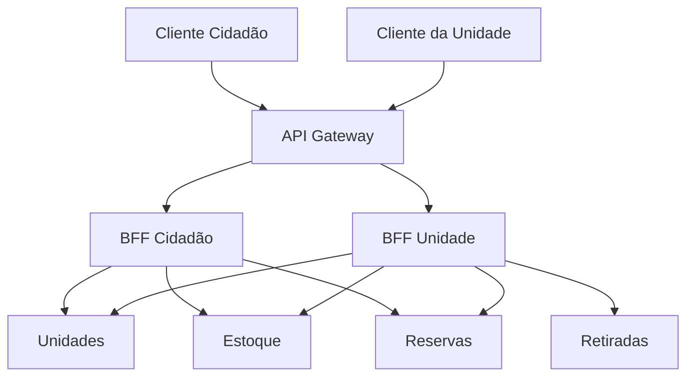
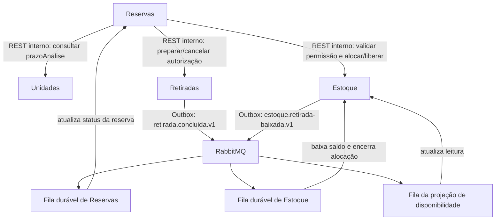
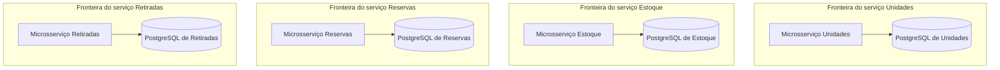

# GlicoAcesso — diagrama da arquitetura

**Etapa:** 2 — Arquitetura  
**Documento:** 02 — Diagrama de arquitetura  
**Versão:** 1.0  
**Situação:** representação dos componentes e das comunicações definidos nos documentos 00 e 01  
**Documento normativo:** [00 — Decisões arquiteturais compartilhadas](./00-decisoes-compartilhadas.md)  
**Documento complementar:** [01 — Decomposição e fronteiras dos microsserviços](./01-microsservicos.md)  
**Última revisão:** 9 de outubro de 2026

> Este documento representa visualmente a arquitetura lógica do GlicoAcesso. Os limites dos serviços, as responsabilidades, os identificadores, os estados e os eventos são os definidos nos documentos 00 e 01. Se um desenho aqui parecer contradizê-los, prevalecem os documentos 00 e 01.

## 1. Objetivo e escopo

O requisito 4.1 do enunciado pede um diagrama de componentes e de comunicação entre os serviços. Este documento apresenta:

- os dois clientes e o caminho de entrada por API Gateway e BFFs;
- os quatro microsserviços de domínio;
- as chamadas síncronas internas necessárias ao fluxo;
- os eventos assíncronos publicados pela Outbox e consumidos por filas independentes;
- o banco PostgreSQL próprio de cada serviço.

O diagrama é lógico e mostra responsabilidades e fluxos. Ele não representa implantação física, quantidade de réplicas, portas, endereços de rede, configuração de cluster, esquema de tabelas ou especificações completas de API. Esses detalhes pertencem aos documentos de Gateway, BFFs, OpenAPI, bancos, consistência, Outbox e CQRS.

## 2. Componentes da arquitetura

| Componente | Tipo | Responsabilidade no sistema | Acesso a dados |
|---|---|---|---|
| Cliente Cidadão | Cliente | Consultar unidades e disponibilidade; criar, acompanhar e cancelar a própria solicitação conforme as regras de estado. | Não acessa bancos nem microsserviços diretamente. |
| Cliente da Unidade | Cliente | Consultar solicitações da unidade, decidir sobre elas, administrar estoque e registrar retiradas autorizadas conforme permissões. | Não acessa bancos nem microsserviços diretamente. |
| API Gateway | Componente de entrada | Receber as chamadas externas e encaminhar cada público ao BFF correspondente; aplicar responsabilidades transversais definidas no documento 06. | Não possui dados de domínio e não coordena a SAGA. |
| BFF Cidadão | Backend de apresentação | Compor as consultas e operações necessárias à experiência do cidadão. | Consome APIs dos serviços; não acessa bancos e não é dono de regras de domínio. |
| BFF Unidade | Backend de apresentação | Compor consultas e operações de trabalho da equipe da unidade. | Consome APIs dos serviços; não acessa bancos e não coordena a SAGA. |
| Unidades | Microsserviço de domínio | Manter cadastro e informações de atendimento da unidade, além do prazo de análise configurado. | Único proprietário dos dados de Unidades em sua instância PostgreSQL. |
| Estoque | Microsserviço de domínio | Manter catálogo, saldo físico, movimentações, alocações, configuração de permissão de reserva e projeção de disponibilidade. | Único proprietário dos dados de Estoque em sua instância PostgreSQL. |
| Reservas | Microsserviço de domínio | Manter solicitações e estados de negócio; coordenar a SAGA de confirmação e o cancelamento distribuído. | Único proprietário dos dados de Reservas e do registro durável da SAGA em sua instância PostgreSQL. |
| Retiradas | Microsserviço de domínio | Preparar/cancelar autorizações e registrar a entrega presencial. | Único proprietário dos dados de Retiradas em sua instância PostgreSQL. |
| RabbitMQ | Broker de eventos | Transportar eventos publicados por serviços para consumidores independentes. | Não é fonte de verdade de dados de domínio. |
| Provedor de identidade | Componente externo opcional | Autenticar atores e fornecer identificadores estáveis. | Credenciais e tokens não são armazenados nos bancos dos microsserviços. |

Gateway, BFFs, RabbitMQ e provedor de identidade não são microsserviços de domínio adicionais. A decomposição de domínio continua contendo somente Unidades, Estoque, Reservas e Retiradas.

## 3. Caminho das chamadas dos clientes

As chamadas externas seguem o caminho **cliente → API Gateway → BFF do público → APIs dos serviços de domínio**. O Gateway não expõe as APIs internas dos microsserviços aos clientes.

| Público | BFF encaminhado pelo Gateway | Serviços de domínio que podem ser consultados pelo BFF |
|---|---|---|
| Cidadão | BFF Cidadão | Unidades, Estoque e Reservas. |
| Profissional da unidade | BFF Unidade | Unidades, Estoque, Reservas e Retiradas. |

O diagrama indica capacidades de comunicação, não que cada tela chame todos os serviços. Cada BFF chama somente os serviços necessários à operação solicitada. A autorização é validada na borda e também pelos serviços responsáveis pela operação; o BFF não é a única barreira de autorização.

As APIs públicas seguem os prefixos /api/cidadao/v1 e /api/unidade/v1. As chamadas entre serviços usam rotas internas versionadas sob /internal/v1, que não são publicadas pelo Gateway. Os endpoints e suas respostas são definidos nos arquivos OpenAPI e nos documentos 05–07.

## 4. Comunicação entre os microsserviços

Há dois tipos de comunicação entre os serviços:

- **REST interno síncrono:** usado quando o serviço precisa de uma decisão ou resposta imediata do proprietário da informação;
- **eventos RabbitMQ assíncronos:** usados para comunicar fatos que já foram confirmados localmente e atualizar estados derivados ou projeções.

### 4.1 Chamadas internas de Reservas

Reservas mantém o controle do fluxo de negócio, mas não grava dados nos bancos dos participantes:

1. Ao criar uma solicitação, consulta Estoque para validar se a unidade permite reservar aquele item e consulta Unidades para obter o prazo de análise. Depois, grava SOLICITADA e o instante limite decisaoAte em seu próprio banco.
2. Após a aceitação pela unidade, inicia a SAGA e envia comandos internos idempotentes a Estoque e Retiradas.
3. Estoque valida e cria a alocação no seu banco.
4. Retiradas prepara a autorização no seu banco.
5. Reservas grava CONFIRMADA somente após confirmar os efeitos exigidos das duas etapas.

Unidades participa da validação inicial da solicitação, mas não é participante da SAGA de confirmação.

### 4.2 Evento de retirada física e baixa de estoque

O registro de entrega física ocorre em Retiradas. Após confirmar esse fato no próprio banco, Retiradas grava o evento retirada.concluida.v1 na sua Outbox para publicação pelo RabbitMQ.

Esse evento tem **dois consumidores independentes**, cada um com sua própria fila durável:

- **Reservas** consome o evento e atualiza o status da reserva de CONFIRMADA para RETIRADA.
- **Estoque** consome o evento e, em uma transação local idempotente, valida a alocação vinculada ao reservaId, registra a saída física, encerra a alocação e grava estoque.retirada-baixada.v1 na própria Outbox.

A projeção de disponibilidade consome estoque.retirada-baixada.v1 para refletir a redução do estoque físico e o encerramento da alocação. A fila de Reservas e a fila de Estoque não podem ser compartilhadas como uma única fila de consumidores concorrentes: ambos os serviços precisam receber o fato.

Nenhum desses passos autoriza um serviço a gravar no banco de outro. Retiradas é a autoridade do registro da entrega; Estoque é a autoridade da quantidade e da alocação; Reservas é a autoridade do estado da solicitação.

## 5. Bancos e propriedade dos dados

Cada microsserviço tem uma instância PostgreSQL independente. As setas abaixo indicam propriedade e gravação local, não compartilhamento de banco.

| Banco | Único serviço autorizado a gravar | Exemplos de dados sob sua propriedade |
|---|---|---|
| PostgreSQL de Unidades | Unidades | Cadastro, endereço, horários, informações de atendimento e prazo de análise. |
| PostgreSQL de Estoque | Estoque | Catálogo, saldo físico, movimentações, permissão de reserva, alocações, projeções, Inbox de consumidores e Outbox de eventos de Estoque. |
| PostgreSQL de Reservas | Reservas | Solicitações, status, decisões, auditoria e estado durável das execuções da SAGA. |
| PostgreSQL de Retiradas | Retiradas | Autorizações, cancelamentos e registros das entregas presenciais, além de sua Outbox para retirada.concluida.v1. |

Não há chave estrangeira entre instâncias. Uma relação com dados de outro serviço é representada por identificador estável, como unidadeId, itemId ou reservaId, e validada por contrato ou evento. Uma API, BFF, consumidor RabbitMQ ou job não pode contornar essa regra consultando diretamente outro banco.

## 6. Fluxos representados

### 6.1 Consulta e criação da solicitação

1. O cidadão consulta unidades e disponibilidade pelo BFF Cidadão.
2. O BFF pode combinar informações de Unidades e da projeção de disponibilidade de Estoque.
3. A disponibilidade é informativa e pode estar alguns segundos atrasada.
4. Ao solicitar um item, Reservas valida a permissão com Estoque e obtém o prazo de análise com Unidades.
5. Reservas grava a solicitação em seu próprio banco como SOLICITADA. A consulta de disponibilidade não reserva nem garante a quantidade.

### 6.2 Confirmação da reserva

1. O profissional da unidade aceita a solicitação no BFF Unidade.
2. Reservas grava a decisão e inicia sua SAGA durável.
3. Reservas solicita a alocação a Estoque.
4. Se Estoque confirmar a alocação, Reservas solicita a preparação da autorização a Retiradas.
5. Se as duas operações forem confirmadas, Reservas grava CONFIRMADA.
6. Se uma etapa posterior falhar, Reservas coordena somente as compensações necessárias, em ordem inversa aos efeitos concluídos. O detalhamento está no documento 04.

### 6.3 Cancelamento antes da retirada física

O cancelamento de uma reserva ativa é coordenado por Reservas. Se houver efeitos distribuídos, Reservas solicita o cancelamento da autorização a Retiradas e a liberação da alocação a Estoque. A reserva só passa a CANCELADA depois da confirmação das operações aplicáveis. O conflito entre cancelar e registrar a entrega é serializado em Retiradas.

### 6.4 Registro da retirada física

Após a autorização ser validada no balcão, Retiradas grava a entrega física e publica retirada.concluida.v1 pela Outbox. Reservas e Estoque recebem o evento em filas separadas. Reservas atualiza o status para RETIRADA; Estoque baixa o saldo e encerra a alocação. A baixa de Estoque gera estoque.retirada-baixada.v1 para atualizar a projeção de disponibilidade.

## 7. Consistência, duplicidade e recuperação

- Cada gravação de negócio pertence ao serviço dono dos dados e é confirmada em transação local.
- Não existe transação ACID distribuída entre os quatro bancos.
- O RabbitMQ entrega mensagens pelo menos uma vez. Uma mensagem pode ser recebida mais de uma vez.
- Todo consumidor deve deduplicar pelo eventId e executar seus efeitos de forma idempotente.
- O consumidor de Estoque deve gravar a deduplicação, a baixa física, o encerramento da alocação e a nova linha de Outbox na mesma transação local.
- Se a alocação não corresponder ao evento de retirada, Estoque não faz uma baixa parcial ou arbitrária; a ocorrência deve ficar observável para reconciliação e reprocessamento.
- Se um serviço estiver temporariamente indisponível, a mensagem permanece recuperável por retry/backoff ou pelo mecanismo de falha operacional definido no documento 10.
- A disponibilidade de leitura pode ficar defasada em relação ao modelo de escrita. A resposta deve informar atualizadoEm; a alocação sempre valida o saldo canônico no modelo de escrita de Estoque.
- Depois da retirada, a alocação permanece ativa até Estoque consumir o evento. Durante esse intervalo, a quantidade não pode voltar a ser oferecida para outra reserva.

O objetivo para atualização de projeções é até 5 segundos em condições normais. Atrasos acima desse limite devem ser sinalizados e monitorados, conforme os documentos 09–11.

## 8. Convenções de leitura do diagrama

| Elemento ou rótulo | Significado |
|---|---|
| Seta de cliente para Gateway | Chamada externa do cliente. |
| Seta de Gateway para BFF | Encaminhamento conforme o público e a rota pública. |
| Seta de Reservas para outro serviço com rótulo REST interno | Chamada síncrona e versionada usada para validar ou executar um comando. |
| Seta de serviço para RabbitMQ com rótulo Outbox | Fato gravado localmente e publicado de modo assíncrono pelo padrão Outbox. |
| Fila durável separada por consumidor | Cada serviço recebe sua própria cópia lógica do evento; os consumidores não competem pela mensagem. |
| Seta de um serviço para seu PostgreSQL | O serviço é o único proprietário e gravador daquele banco. |

Os diagramas não indicam uma chamada direta entre bancos, uma transação compartilhada ou um acesso do cliente aos microsserviços sem passar pelo Gateway e pelo BFF.

## 9. Decisões de implantação que ainda não estão neste documento

Este desenho não fixa linguagem, framework, endereço de rede, porta, topologia de cluster RabbitMQ, nomes físicos de filas, número de réplicas, serviço de descoberta ou formato de deployment. Essas escolhas podem ser definidas em documentos posteriores, desde que preservem:

- as quatro fronteiras de domínio;
- um PostgreSQL independente por microsserviço;
- o Gateway como ponto de entrada para os dois BFFs;
- a coordenação da SAGA por Reservas;
- eventos publicados por Outbox e consumidores idempotentes;
- ausência de leitura ou gravação cruzada entre bancos.

## 10. Critério de conformidade

O diagrama está de acordo com a arquitetura quando:

- mostra exatamente os quatro microsserviços de domínio: Unidades, Estoque, Reservas e Retiradas;
- representa os clientes passando pelo Gateway e pelo BFF correspondente;
- não expõe as APIs internas diretamente aos clientes;
- mostra chamadas internas de Reservas a Unidades, Estoque e Retiradas conforme o fluxo definido;
- representa RabbitMQ como comunicação por eventos, sem transferir a coordenação da SAGA para o broker;
- mostra retirada.concluida.v1 chegando a Reservas e Estoque por filas duráveis independentes;
- mostra Estoque gerando estoque.retirada-baixada.v1 para a projeção de disponibilidade;
- representa uma instância PostgreSQL independente para cada serviço;
- não contém setas de acesso de um serviço ao banco de outro;
- preserva os estados, eventos e identificadores do documento 00.

## 11. Referências

- [00 — Decisões arquiteturais compartilhadas](./00-decisoes-compartilhadas.md): contrato normativo de serviços, estados, identificadores, SAGA, eventos, Outbox e CQRS.
- [01 — Decomposição e fronteiras dos microsserviços](./01-microsservicos.md): justificativa e responsabilidades detalhadas dos serviços.
- [03 — Fluxo de reservas](./03-fluxo-reservas.md): fluxo de negócio e estados, previsto na estrutura da Etapa 2.
- [04 — SAGA](./04-saga.md): confirmação, falhas, compensações e recuperação, previsto na estrutura da Etapa 2.
- [06 — API Gateway](./06-api-gateway.md) e [07 — BFFs](./07-bffs.md): roteamento e composição das chamadas dos clientes, previstos na estrutura da Etapa 2.