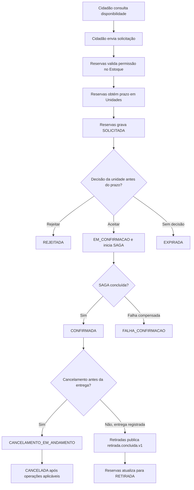

# GlicoAcesso — fluxo de reservas

**Etapa:** 2 — Arquitetura  
**Documento:** 03 — Fluxo de reservas  
**Versão:** 1.0  
**Escopo:** comportamento de negócio de uma solicitação desde sua criação até um resultado terminal  
**Documento normativo:** [00 — Decisões arquiteturais compartilhadas](./00-decisoes-compartilhadas.md)  
**Documento de fronteiras:** [01 — Decomposição e fronteiras dos microsserviços](./01-microsservicos.md)  
**Diagrama de componentes:** [02 — Diagrama de arquitetura](./02-diagrama-arquitetura.md)  
**Última revisão:** 9 de outubro de 2026

> Este documento detalha o fluxo de negócio da reserva. A SAGA, seus comandos, compensações, estados internos, timeouts e recuperação são especificados no documento [04 — SAGA](./04-saga.md). Em caso de divergência, prevalecem as decisões do documento 00.

## 1. Objetivo

Descrever de forma verificável o que acontece quando um cidadão solicita um item a uma unidade, como a unidade decide, como a solicitação é confirmada ou encerrada, e como a retirada física atualiza os serviços envolvidos.

Uma reserva representa **um único item, para uma única unidade de retirada e uma quantidade positiva**. Se o cidadão precisar de itens diferentes, deve criar solicitações independentes.

Este fluxo não define a estrutura física das tabelas, o formato completo dos endpoints nem a implantação. Esses detalhes pertencem aos documentos de persistência, OpenAPI, Gateway, BFFs, Outbox e CQRS.

## 2. Atores e serviços envolvidos

| Ator ou serviço | Participação no fluxo |
|---|---|
| Cidadão | Consulta disponibilidade, cria e acompanha a própria solicitação e pode cancelá-la antes da retirada física enquanto estiver ativa. |
| Profissional da unidade | Consulta solicitações da unidade, aceita, rejeita ou cancela uma solicitação. Ao cancelar, deve fornecer justificativa. Registra a entrega presencial pelo fluxo de Retiradas. |
| BFF Cidadão | Encaminha as operações do cidadão a Reservas e pode agregar informações de consulta. Não decide regras de domínio. |
| BFF Unidade | Encaminha as operações profissionais aos serviços responsáveis. Não decide regras de domínio nem coordena a SAGA. |
| Reservas | É proprietário da solicitação e de seu estado de negócio. Valida regras do fluxo, consulta os dados necessários, inicia a SAGA e atualiza o estado quando consome o evento de retirada. |
| Unidades | É proprietário do prazo de análise configurado para cada unidade. |
| Estoque | É proprietário da permissão de reserva, do saldo físico e das alocações. Decide a disponibilidade real no momento da alocação. |
| Retiradas | É proprietário da autorização de balcão e do registro da entrega física. Publica o evento da retirada concluída. |

Clientes acessam os serviços pelo API Gateway e pelo BFF correspondente. Nenhum cliente ou BFF acessa diretamente os bancos de domínio.

## 3. Dados mínimos da solicitação

O BFF Cidadão envia a Reservas os seguintes dados de negócio:

| Campo | Obrigatório | Origem e regra |
|---|---:|---|
| `unidadeId` | Sim | Unidade escolhida; identificador estável criado por Unidades. |
| `itemId` | Sim | Medicamento ou insumo escolhido; identificador criado por Estoque. |
| `quantidade` | Sim | Inteiro positivo, sujeito às regras de Estoque. |
| Identidade autenticada do cidadão | Sim | Obtida da autenticação confiável; não deve ser aceita como identidade arbitrária enviada no corpo da requisição. |
| `idempotencyKey` | Recomendado para criação | Chave que permite repetir uma tentativa sem criar solicitações duplicadas. Regras gerais estão no documento 00. |

Reservas gera o `reservaId`, registra o instante `criadaEm` e calcula `decisaoAte` com base no `prazoAnalise` fornecido por Unidades. O cidadão não escolhe nem altera esse prazo.

O cadastro da reserva armazena somente os dados necessários ao processo: identificadores estáveis, quantidade, estado, datas, decisão e informações mínimas de auditoria. Credenciais, tokens e cópias de documentos de saúde não são armazenados na reserva.

## 4. Visão geral do fluxo

O diagrama resume os caminhos de negócio. A ordem técnica da confirmação e das compensações é detalhada no documento 04.

## 5. Fluxo A — consulta e criação

### 5.1 Consulta de disponibilidade

1. O cidadão escolhe unidade, item e quantidade pretendida.
2. O BFF Cidadão obtém as informações necessárias em Unidades e na projeção de disponibilidade de Estoque.
3. A resposta de disponibilidade informa `atualizadoEm`, pois a projeção pode estar defasada em relação ao saldo canônico.
4. A consulta não cria reserva, não aloca quantidade e não garante que ainda haverá saldo quando a solicitação for processada.

### 5.2 Criação da solicitação

1. O cidadão autenticado envia `unidadeId`, `itemId` e `quantidade` ao BFF Cidadão.
2. O BFF encaminha a operação a Reservas; a identidade do cidadão vem do contexto de autenticação confiável.
3. Reservas valida a forma dos dados e consulta Estoque para confirmar que a combinação de unidade e item permite reservas (`permiteReserva = true`).
4. Reservas consulta Unidades para obter o `prazoAnalise` vigente para a unidade. Uma unidade que permite reservas deve ter esse prazo configurado.
5. Se as validações forem aprovadas, Reservas grava em seu próprio banco:
   - o `reservaId` gerado;
   - a identidade estável do cidadão;
   - `unidadeId`, `itemId` e `quantidade`;
   - `criadaEm`;
   - o `prazoAnalise` aplicado ou informação suficiente para auditoria;
   - `decisaoAte = criadaEm + prazoAnalise`;
   - `status = SOLICITADA`.
6. Reservas devolve a representação da solicitação. O resultado é `SOLICITADA`, nunca `CONFIRMADA` nesta etapa.

Se uma validação falhar, Reservas não cria uma solicitação ativa. A API deve distinguir resultado de negócio inválido, falha de autenticação/autorização e indisponibilidade técnica. O detalhamento do contrato HTTP fica nos arquivos OpenAPI.

## 6. Fluxo B — decisão da unidade

### 6.1 Autorização e prazo

Antes de aceitar ou rejeitar, o sistema verifica que:

- o ator é um profissional autenticado e autorizado;
- o profissional está vinculado à unidade indicada na solicitação;
- a reserva ainda está `SOLICITADA`;
- a decisão ocorre antes de a expiração vencer a concorrência, conforme `decisaoAte`.

O estado deve ser atualizado condicionalmente no banco de Reservas para impedir que duas decisões concorrentes sejam confirmadas. A autorização do BFF, sozinha, não substitui a validação do serviço.

### 6.2 Rejeição

1. O profissional escolhe rejeitar uma solicitação `SOLICITADA`.
2. Reservas valida a permissão e grava a decisão no seu próprio banco.
3. O estado passa para `REJEITADA`, que é terminal.
4. Não se inicia SAGA e não se cria autorização ou alocação de estoque.
5. A solicitação deixa de aceitar cancelamento ou nova decisão. Se o cidadão ainda precisar do item, deverá criar outra solicitação.

### 6.3 Aceitação

1. O profissional escolhe aceitar uma solicitação `SOLICITADA`.
2. Reservas valida a permissão, a unidade e o prazo, e registra a decisão.
3. Reservas altera o estado para `EM_CONFIRMACAO` e persiste a execução durável da SAGA.
4. Reservas coordena a alocação no Estoque e, após sua confirmação, a preparação de autorização em Retiradas.
5. Somente quando ambos os efeitos necessários forem confirmados, Reservas muda o estado para `CONFIRMADA`.
6. A resposta apresentada ao cidadão distingue “aceita pela unidade/em confirmação” de “confirmada”. A aceitação profissional, por si só, não garante a disponibilidade nem a confirmação.

Se uma etapa falhar definitivamente, Reservas aplica as compensações previstas no documento 04. Após todas as compensações necessárias serem confirmadas, a solicitação termina como `FALHA_CONFIRMACAO`. Enquanto uma etapa ou compensação estiver pendente, não deve ser apresentada como resultado final.

## 7. Fluxo C — expiração por falta de decisão

1. Reservas monitora solicitações em `SOLICITADA` cujo `decisaoAte` foi atingido.
2. Quando `agora >= decisaoAte`, Reservas tenta mudar condicionalmente o estado para `EXPIRADA`.
3. Se a expiração vencer a corrida contra uma decisão da unidade, a solicitação passa a `EXPIRADA` e a decisão posterior é recusada.
4. Se a decisão autorizada for gravada primeiro, a expiração não altera a reserva. Se a decisão for aceitar, a reserva segue para `EM_CONFIRMACAO`; se for rejeitar, segue para `REJEITADA`.
5. A expiração só se aplica a `SOLICITADA`. Uma reserva em `EM_CONFIRMACAO` não expira por relógio; o processamento é resolvido pela SAGA ou por cancelamento.
6. Como nenhuma alocação é feita antes do aceite, expirar uma solicitação não requer liberação de estoque.

`EXPIRADA` é terminal. Uma nova tentativa exige outra solicitação.

## 8. Fluxo D — cancelamento pelo cidadão ou profissional

O cancelamento é permitido antes da retirada física enquanto a reserva estiver ativa. O cidadão só pode cancelar a própria solicitação. Um profissional autenticado e vinculado à unidade da reserva também pode cancelar; nesse caso, uma justificativa não vazia é obrigatória e registrada para auditoria.

| Estado no pedido de cancelamento | Comportamento |
|---|---|
| `SOLICITADA` | Reservas cancela localmente, sem chamar Estoque ou Retiradas, e grava `CANCELADA`. |
| `EM_CONFIRMACAO` | Reservas registra `CANCELAMENTO_EM_ANDAMENTO`, interrompe etapas futuras e coordena a compensação dos efeitos que já tenham sido confirmados. Só grava `CANCELADA` após concluir as operações aplicáveis. |
| `CONFIRMADA` | Reservas registra `CANCELAMENTO_EM_ANDAMENTO`, pede a Retiradas que cancele a autorização e a Estoque que libere a alocação. Só grava `CANCELADA` após confirmar as operações aplicáveis. |
| `CANCELAMENTO_EM_ANDAMENTO` | Não inicia um segundo cancelamento concorrente. Retorna o estado atual e permite consultar o andamento. |
| `REJEITADA`, `CANCELADA`, `EXPIRADA`, `FALHA_CONFIRMACAO` ou `RETIRADA` | Recusa o cancelamento adicional porque a reserva está em estado terminal. |

O sistema não comunica `CANCELADA` antes de confirmar a revogação da autorização e a liberação da alocação quando esses efeitos existirem. Timeout de uma chamada não prova que a operação remota falhou; Reservas mantém o cancelamento pendente e reconcilia pelo mesmo identificador idempotente.

## 9. Fluxo E — retirada física

1. O profissional da unidade apresenta/valida a autorização da reserva no serviço de Retiradas.
2. Retiradas confirma que a autorização está válida, corresponde à unidade e à reserva e ainda não foi cancelada nem usada.
3. Retiradas registra a entrega física uma única vez em seu próprio banco e grava `retirada.concluida.v1` na mesma transação local, pela Outbox.
4. A Outbox publica o evento no RabbitMQ. Reservas e Estoque recebem cópias por filas duráveis independentes.
5. Reservas deduplica por `eventId` e atualiza o estado de negócio de `CONFIRMADA` para `RETIRADA` em seu próprio banco.
6. Estoque deduplica por `eventId`, valida a alocação ativa pelo `reservaId` e confere `unidadeId`, `itemId` e `quantidade`. Em uma única transação local, registra a saída física, baixa a quantidade, encerra a alocação e grava `estoque.retirada-baixada.v1` na sua Outbox.
7. A projeção de disponibilidade consome `estoque.retirada-baixada.v1` e atualiza sua leitura.

O evento de retirada contém `retiradaId`, `reservaId`, `unidadeId`, `itemId` e `quantidade`; não contém dados pessoais do cidadão. O evento é um fato já ocorrido e não um comando para realizar a entrega.

Durante o processamento assíncrono pode haver um intervalo em que Retiradas já registrou a entrega, mas Reservas ainda apresenta `CONFIRMADA` ou Estoque ainda mantém a alocação ativa. Até o consumidor de Estoque concluir a transação, a quantidade permanece alocada e não pode ser oferecida para outra solicitação.

Se a entrega física for registrada primeiro, um cancelamento concorrente deve ser recusado. Se o cancelamento da autorização concluir primeiro, a autorização não pode ser usada para registrar a entrega. Retiradas serializa essas operações para que somente um resultado vença.

## 10. Estados de negócio

O estado de negócio pertence a Reservas. Os estados internos da SAGA são diferentes e ficam no documento 04.

| Estado atual | Evento/ação válida | Próximo estado | Terminal? |
|---|---|---|---:|
| — | Solicitação válida criada | `SOLICITADA` | Não |
| `SOLICITADA` | Unidade rejeita | `REJEITADA` | Sim |
| `SOLICITADA` | Unidade aceita dentro do prazo | `EM_CONFIRMACAO` | Não |
| `SOLICITADA` | Cidadão cancela ou profissional cancela com justificativa | `CANCELADA` | Sim |
| `SOLICITADA` | Prazo vence antes de uma decisão concorrente | `EXPIRADA` | Sim |
| `EM_CONFIRMACAO` | Confirmação da SAGA concluída | `CONFIRMADA` | Não |
| `EM_CONFIRMACAO` | Falha final com compensações concluídas | `FALHA_CONFIRMACAO` | Sim |
| `EM_CONFIRMACAO` | Cancelamento solicitado | `CANCELAMENTO_EM_ANDAMENTO` | Não |
| `CONFIRMADA` | Cancelamento solicitado | `CANCELAMENTO_EM_ANDAMENTO` | Não |
| `CANCELAMENTO_EM_ANDAMENTO` | Operações aplicáveis de cancelamento confirmadas | `CANCELADA` | Sim |
| `CONFIRMADA` | Retirada concluída consumida por Reservas | `RETIRADA` | Sim |

Estados terminais: `REJEITADA`, `CANCELADA`, `EXPIRADA`, `FALHA_CONFIRMACAO` e `RETIRADA`. Não há reabertura neste escopo. Para tentar novamente, o cidadão cria uma nova solicitação.

Regras invariantes:

- Não existe transição direta de `SOLICITADA` para `CONFIRMADA`.
- `CONFIRMADA` só é registrada após a alocação e a preparação da autorização estarem confirmadas.
- O estoque não é alocado na criação da solicitação; a alocação ocorre depois do aceite.
- Somente Retiradas registra a entrega física. Somente Estoque altera saldo físico e alocação. Somente Reservas altera o estado de negócio da solicitação.
- Cancelamento nunca é aceito depois da entrega física ser registrada.
- Uma solicitação terminal não volta a um estado anterior.
- A repetição de comandos ou eventos não pode duplicar solicitações, alocações, cancelamentos, entregas ou baixas.

## 11. Erros de negócio e respostas esperadas

Os contratos HTTP devem distinguir o resultado de negócio de falhas técnicas. A tabela define o significado esperado, sem fixar códigos HTTP, que ficam no OpenAPI.

| Situação | Resultado de negócio esperado | Efeito na reserva |
|---|---|---|
| Unidade não permite reservas para o item | Solicitação não aceita | Não cria reserva ativa. |
| `unidadeId` ou `itemId` inválido/inexistente | Solicitação não aceita | Não cria reserva ativa. |
| Quantidade ausente, não positiva ou fora das regras | Solicitação não aceita | Não cria reserva ativa. |
| Prazo de análise da unidade não configurado | Configuração inválida; sinalizar falha operacional | Não cria reserva ativa. |
| Cidadão não autenticado ou sem propriedade da reserva | Acesso não autorizado | Nenhuma alteração. |
| Profissional não vinculado à unidade da reserva | Ação não autorizada | Nenhuma alteração. |
| Decisão após expiração ou em estado diferente de `SOLICITADA` | Conflito de estado | Nenhuma nova decisão. |
| Estoque insuficiente no momento da alocação | Falha de confirmação de negócio | Após compensações concluídas, `FALHA_CONFIRMACAO`. |
| Retirada cancelada ou já concluída quando se tenta cancelar | Conflito de estado | Estado coerente com o resultado que venceu. |
| Retry da mesma operação com a mesma chave e mesmo conteúdo | Devolver resultado original | Não duplica efeito. |
| Mesma chave idempotente com conteúdo diferente | Conflito de idempotência | Nenhum efeito novo. |
| Serviço ou broker indisponível/timeout | Falha técnica ou processamento pendente, conforme a etapa | Não declarar sucesso/falha definitiva sem reconciliar resultado incerto. |

## 12. Idempotência e concorrência

- Criação repetida com a mesma `idempotencyKey` e o mesmo conteúdo devolve a solicitação original. A mesma chave com conteúdo diferente é conflito.
- A aceitação, rejeição, expiração e cancelamento usam atualização condicional de estado para que apenas uma ação concorrente vença.
- Os comandos internos da SAGA usam `sagaId`, `reservaId` e chave idempotente estável; detalhes estão no documento 04.
- Uma entrega é única por autorização/reserva. Retentativas não geram novo `retiradaId` nem nova baixa.
- Consumidores de eventos deduplicam pelo `eventId` e confirmam efeitos de negócio em transação local.
- A fila de Reservas e a fila de Estoque para `retirada.concluida.v1` são independentes. Um consumidor não pode retirar a mensagem da fila compartilhada e impedir que o outro serviço receba o fato.
- Comandos de alocação usam o modelo de escrita canônico de Estoque. A projeção de disponibilidade nunca é autoridade para reservar quantidade.

## 13. Auditoria e informações apresentadas

Reservas registra, no mínimo, os eventos de negócio necessários para entender a história da solicitação:

- criação e instante de criação;
- decisão de aceitar ou rejeitar, ator e instante;
- transições de estado;
- pedido de cancelamento, ator e instante;
- justificativa quando o cancelamento é feito por profissional;
- identificadores de correlação e da SAGA necessários à rastreabilidade.

O cidadão deve conseguir distinguir `SOLICITADA`, `EM_CONFIRMACAO`, `CONFIRMADA`, `CANCELAMENTO_EM_ANDAMENTO` e um estado terminal. Não se deve mostrar detalhes internos de exceções, nomes de filas, stack traces ou dados de outros cidadãos.

## 14. Critérios de conformidade

O fluxo está de acordo com as decisões compartilhadas quando:

- cada reserva contém exatamente um item, uma unidade e uma quantidade positiva;
- a criação valida `permiteReserva` em Estoque e obtém `prazoAnalise` em Unidades;
- o estado inicial é `SOLICITADA`, com `decisaoAte` calculado e persistido por Reservas;
- aceitação e rejeição só podem ser feitas por profissional autorizado da unidade da solicitação;
- a aceitação inicia a SAGA, mas não informa confirmação antes da alocação e da autorização;
- expiração ocorre somente em `SOLICITADA` e disputa atomicamente com a decisão;
- cidadão pode cancelar a própria solicitação ativa antes da entrega; profissional da unidade também pode cancelar, com justificativa registrada;
- cancelamento distribuído só termina em `CANCELADA` após as operações aplicáveis serem confirmadas;
- a retirada física é registrada em Retiradas e comunicada por `retirada.concluida.v1` via Outbox;
- Reservas e Estoque recebem o evento em filas separadas e atualizam somente seus próprios bancos;
- Estoque baixa a quantidade e encerra a alocação em uma transação local idempotente;
- estados terminais não podem ser reabertos e cada operação é protegida contra duplicidade;
- os contratos HTTP distinguem resultados de negócio, autorização e falhas técnicas.

## 15. Referências

- [00 — Decisões arquiteturais compartilhadas](./00-decisoes-compartilhadas.md): estados canônicos, regras de cancelamento, expiração, eventos, SAGA, idempotência e propriedade dos dados.
- [01 — Decomposição e fronteiras dos microsserviços](./01-microsservicos.md): responsabilidades de Reservas, Estoque, Unidades e Retiradas.
- [02 — Diagrama de arquitetura](./02-diagrama-arquitetura.md): componentes, bancos e comunicações síncronas e assíncronas.
- [04 — SAGA](./04-saga.md): sequência técnica da confirmação, compensações, cancelamento distribuído, falhas e recuperação.
- Documentos OpenAPI e de HATEOAS: contratos de entrada, saída, autorização e ações disponíveis ao cliente.