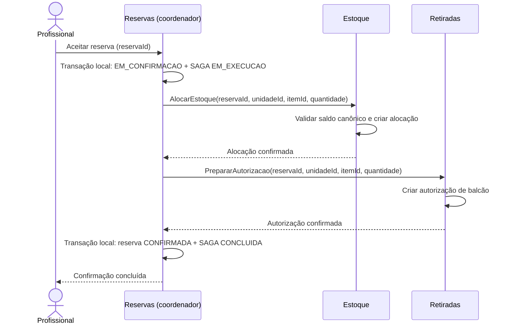

# GlicoAcesso — SAGA: caminho de sucesso

**Referência:** [04 — SAGA de confirmação e cancelamento](../04-saga.md)

Este diagrama mostra a confirmação após o profissional aceitar uma solicitação `SOLICITADA`. O estado só vira `CONFIRMADA` depois que Estoque confirma a alocação, Retiradas confirma a autorização e Reservas persiste a finalização local.

AlocarEstoque e PrepararAutorizacao são comandos internos idempotentes. As chamadas e gravações pertencem aos serviços correspondentes; não existe transação compartilhada.